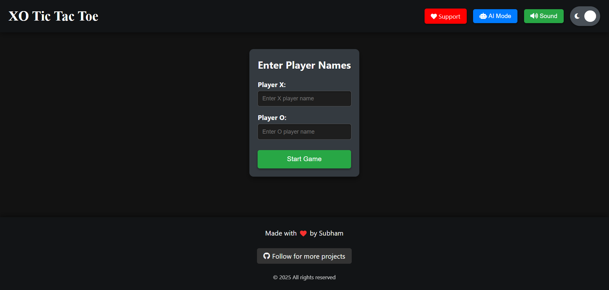
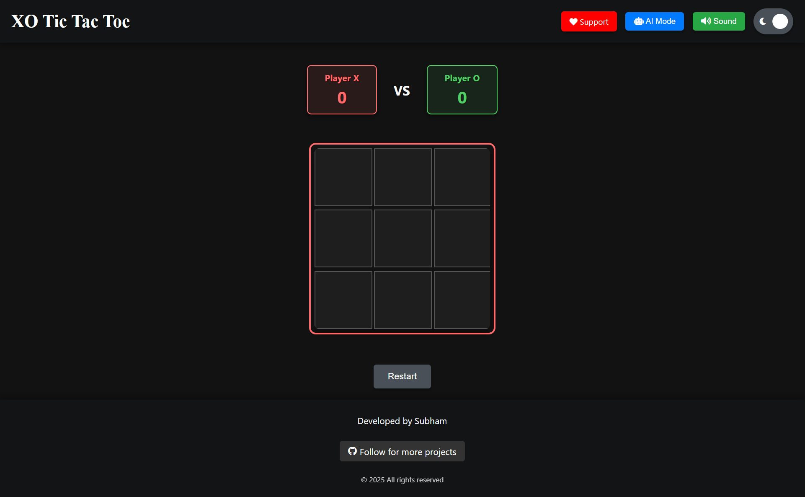
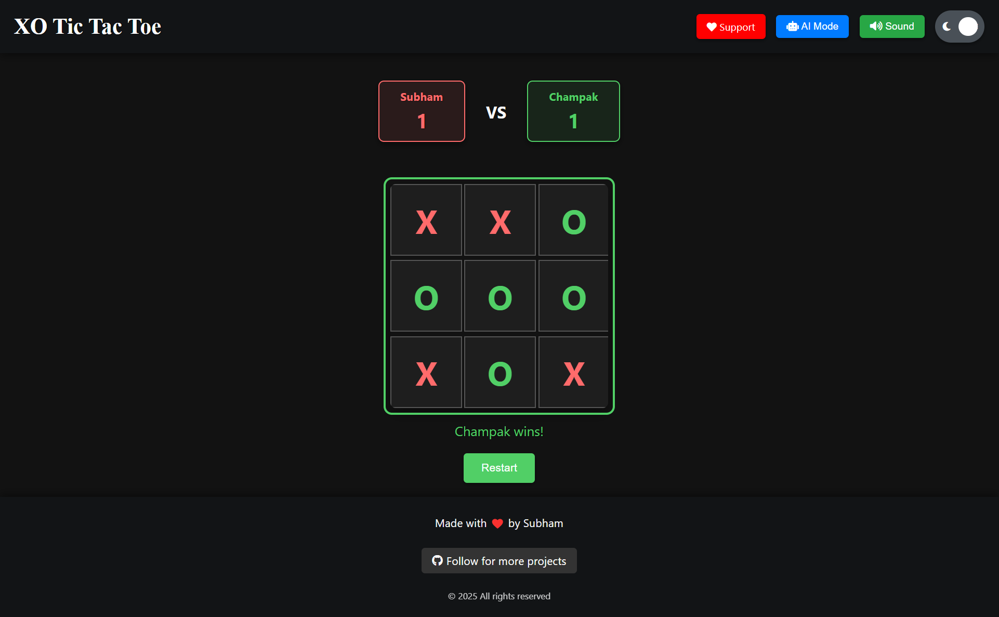

# 🎮 Tic Tac Toe – Feature-Rich Web Game

An interactive, fully responsive **Tic Tac Toe** game built using HTML, CSS, and JavaScript. Designed with a clean black, gray, and white aesthetic, it offers features like AI mode, dark/light mode toggle, sound control, and a live scoreboard.

## The game is ON! What are you waiting for??

---

## 🚀 Features

### 🎯 Game Functionality
- ✅ **Responsive Game Board**  
  Smooth and adaptive layout using Flexbox and Grid. Works on desktop, tablet, and mobile devices.
  
- ✅ **AI vs Player Mode**  
  Play against a basic AI or with a friend in 2-player mode.

- ✅ **Winning Animations**  
  Line-through animation highlights the winning row, column, or diagonal.

- ✅ **Scoreboard Tracking**  
  Keeps track of Player X, Player O, and draw scores. Includes reset functionality.

---

### 🧩 UI & Controls

- ✅ **Dark/Light Mode Toggle**  
  Seamless theme switching with saved preferences using `localStorage`.

- ✅ **Sound Toggle**  
  Sound effects for moves and results with an on/off toggle.

- ✅ **Navigation Bar**
  - Game Title  
  - Dark/Light mode button  
  - Sound toggle  
  - Two placeholder buttons for future use

- ✅ **Reset Controls**
  - Restart current game  
  - Reset the entire scoreboard

---

## 🛠️ Tech Stack

| Technology      | Role                                       |
|------------------|---------------------------------------------|
| **HTML5**        | Structure of the game layout                |
| **CSS3**         | Styling, animations, theme handling         |
| **JavaScript**   | Game logic, interactivity, AI, event handling |
| **localStorage** | Persistent storage for user preferences     |

---

## 🌱 Future Enhancements

- [ ] Difficulty levels for AI (easy/medium/hard)
- [ ] Online multiplayer using Firebase/WebSocket
- [ ] Custom player names and leaderboard
- [ ] Mobile app version using Flutter or React Native

---

## 📸 Screenshots

# XO Tic Tac Toe : Landing page
Here we can enter players name and start the game.
  

# XO Board :
  Here we can start playing with friend or Top right corner have PLAY WITH AI option too.

  

# XO Board : SS from mid game
  Changing colors around board tells us who's turn it is.

  

Made with ❤️ by Subham
